# Module 2 Virtualization and Cloud Basic.

## TASK 2.1

### PART 1. HYPERVISORS

1. What are the most popular hypervisors for infrastructure virtualization?

- **_The most popular are Hyper-V (Microsoft), Xen (AWS), Oracle VM, VMware Esxi_**

2. Briefly describe the main differences of the most popular hypervisors.

- **_hypervisors is 2 types:
  Native: first type of hypervisors are installed right on the host's hardware (in order to monitor and control guest machines). Example :
  -Xen (XENSERVER, Citrix Hypervisor)
  -Hyper-V (Microsoft)
  -VMware’s ESX/ESXi
  Host OS: hypervisors run on a regular OS just like other applications on the system. In this case the Guest OS (VM) operates as regular process on the host (hypervisors separate Guest OS (VM) from host OS). Example :
  -Parallels Desktop
  -VMware Workstation
  -Oracle VirtualBox_**

### PART 2. WORK WITH VIRTUALBOX

#### 1. First run VirtualBox and Virtual Machine (VM).

1.1 - 1.2) I checked the VirtualBox manual and downloaded VirtualBox for MacOS and downloaded latest Ubuntu desktop  
1.3) Then I installed VirtualBox and Ubuntu 20.04 Desktop   
1.4) Tried some possibilities of VM (start, stop, reboot, save state, host key). 
1.5) After that I've created a clone for the main VM.  
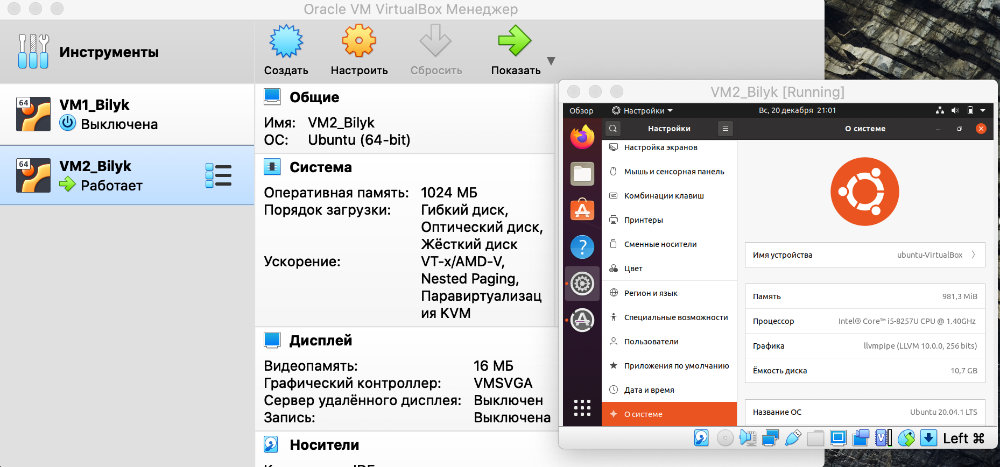 
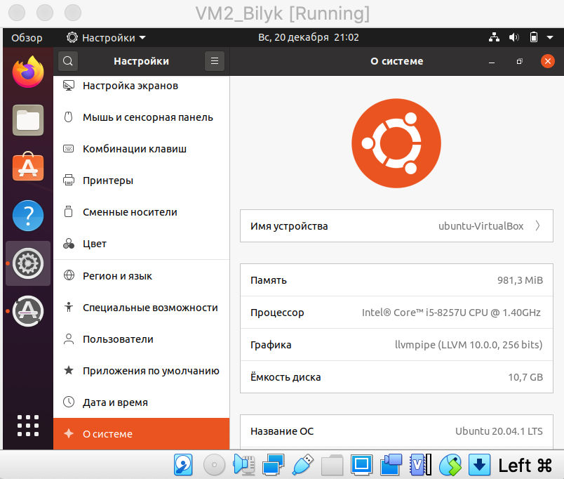 

1.6) Also I've created a group of two VMs  
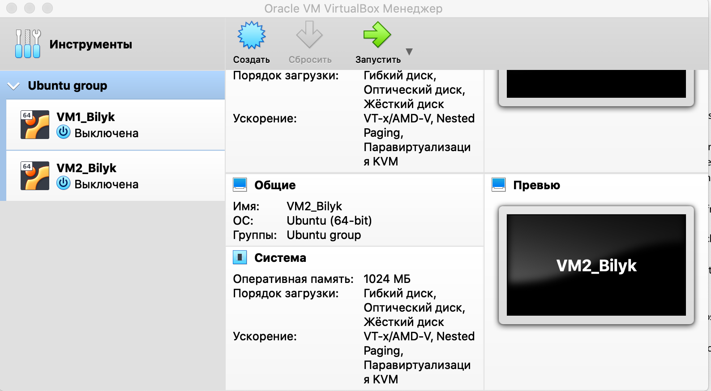 

1.7) I tried to make a branched tree but it stood in one line (queue)  
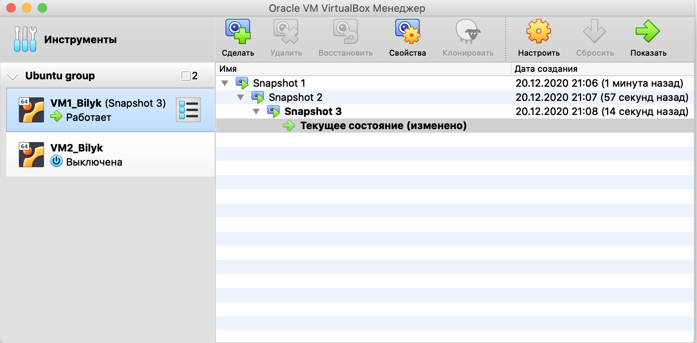 

1.8) Exported and saved ova file of main VM to the local directory. 
After that ova file imported.  
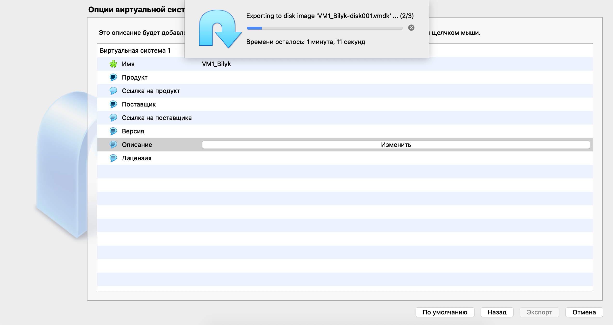  
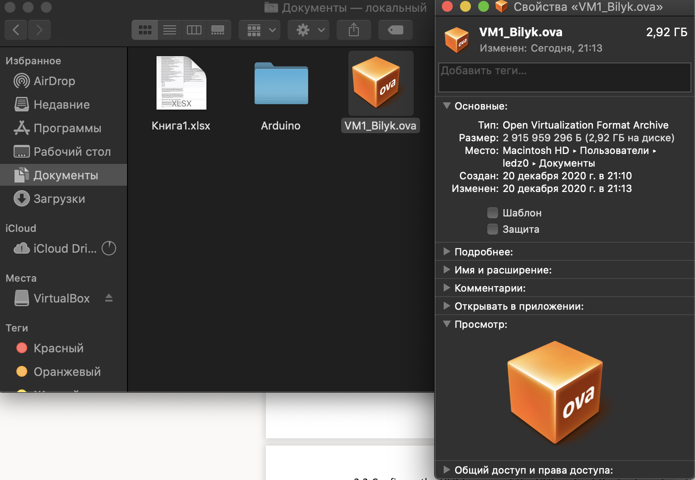  
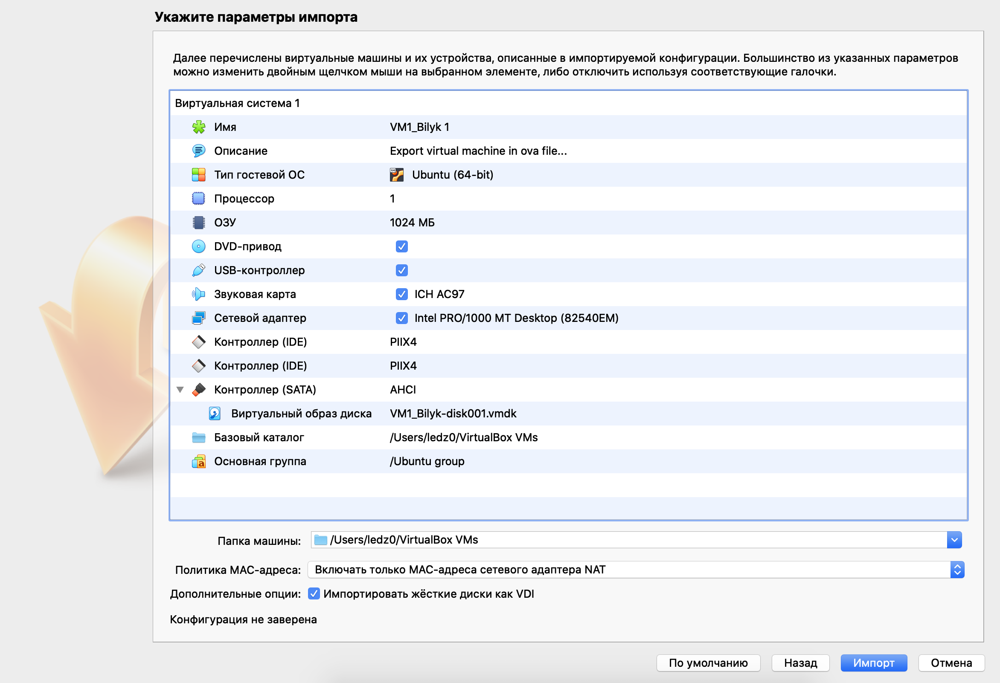  
After the import : 
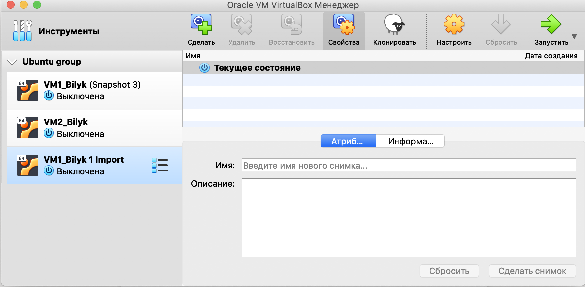  

#### 2. Configuration of virtual machines

2.1 - 2.2) I explored VM general configuration and managed to configure successfully USB between host and VM1. 
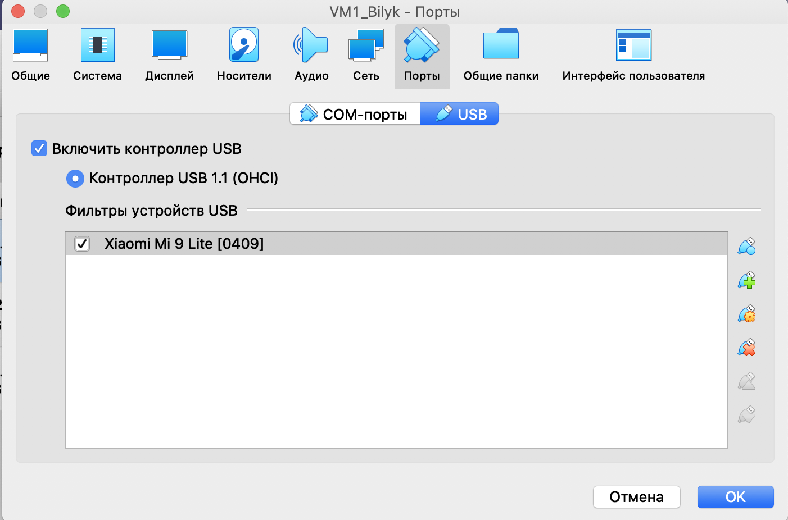  

2.3) Successful configuration of shared folder between host and VM.  
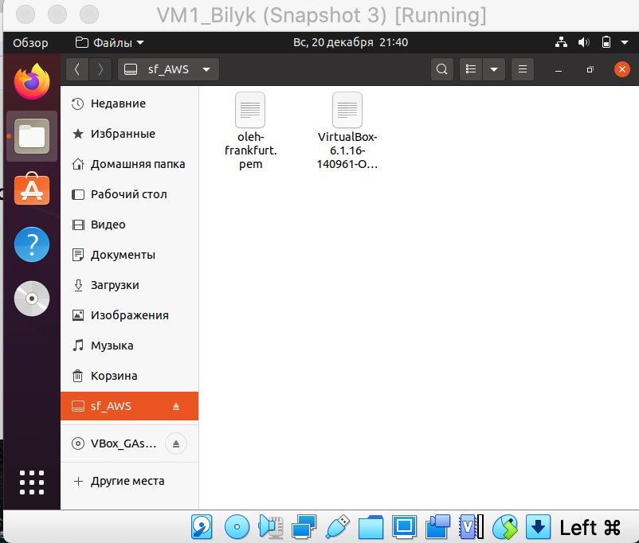  

2.4) I tested different network modes for VM1, VM2. 

Also created a simple table with ping connection review : 
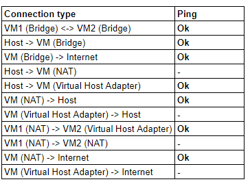 

#### 3. Work with CLI through VBoxManage. 

3.1 - 3.2) I generally explored CLI with VBoxManage (TBD) 
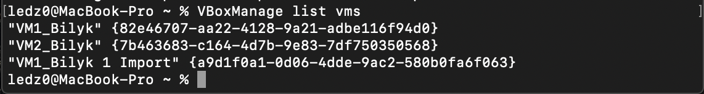  
Currently running VM : 
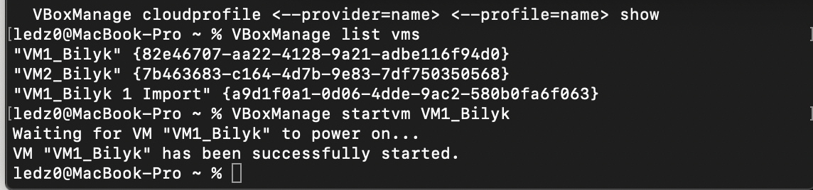 

### PART 3. WORK WITH VAGRANT

1-2) As per the instructions I've downloaded and installed Vagrant. Also I run zsh and checked Vagrant's version. 
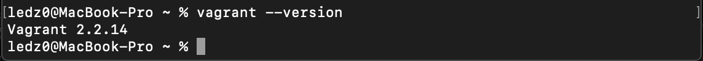  

3-4) Initialization of the environment and it's launch 
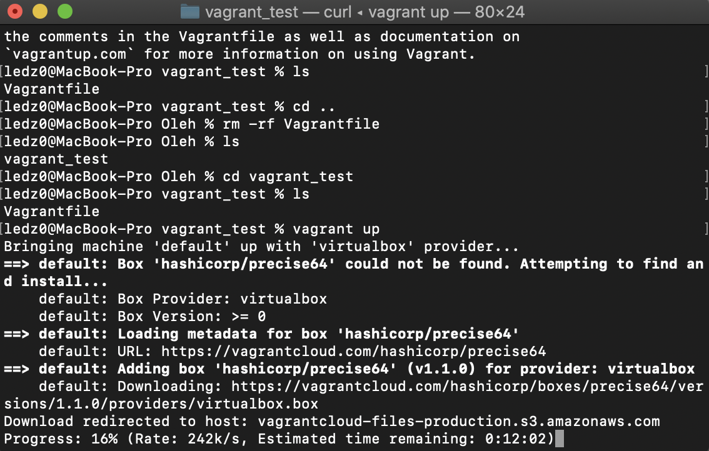  

5. ssh connection via zsh :  
   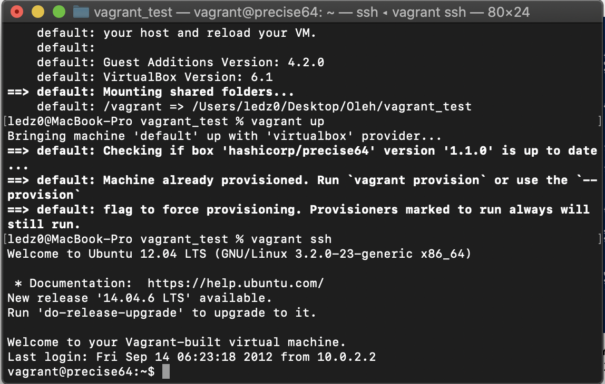  

6. Record of the time and date :  
   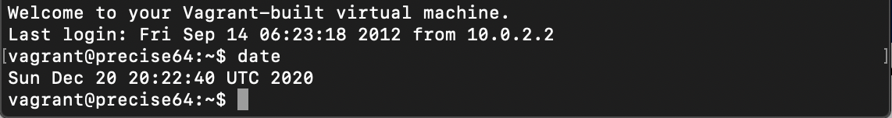  

7. VM is stopped and deleted :  
   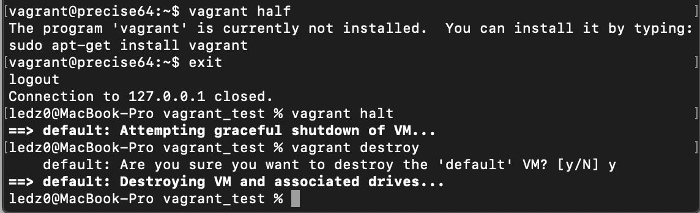  

8. Vagrant box is created :  
   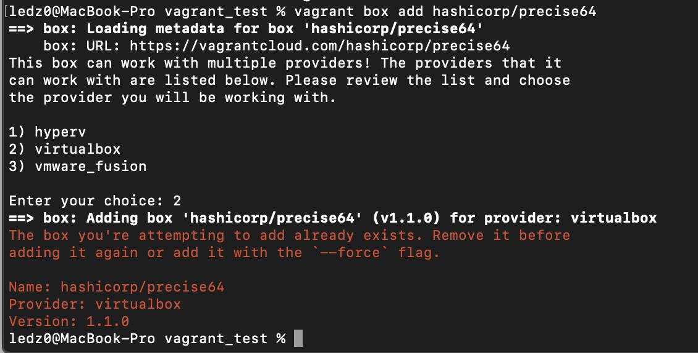  

9. Create a test environment from a few servers. Servers' parameters
   are chosen independently by the student.
    
