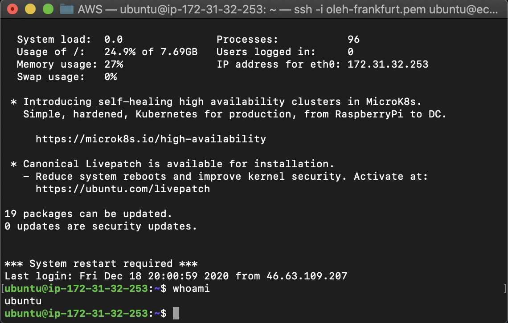
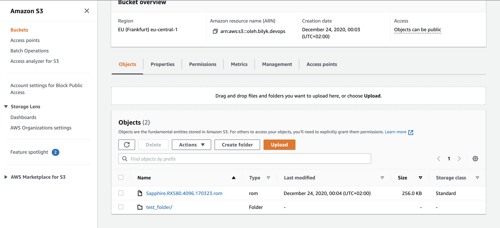

# Module 2 Virtualization and Cloud Basic

## TASK 2.2

1.  I got acquainted with the free AWS services.
2.  A free AWS account has been registered.  
     

3.  Read hands-on tutorials. Amazon Lightsail, Amazon S3, AWS CLI, Launch and configure a WordPress - complete  

4.  Amazon Lightsail service is launched :  
     

5.  EC2 service (t2.micro instance, Ubuntu) is launched :  
      
     

6.  Created snapshot of instance.  
      

        Snapshot from AMI volume/EBS :
          

7.  Creation of additional EBS/Volume to the main instance :  

    - Create EBS/Volume :  
        
    - Volume attach to instance as DISK_D :  
        
    - file.txt stored on new volume :  
        

8.  Launched instance from AMI:  
      

9.  Attached to this instance Disk_D:  
      

10. AWS Lightsail with WordPress is launched and configured :  
      
      

11. I created AWS S3 bucket and uploaded, deleted file and folder :  
      

12. Uploaded files to AWS S3 used the AWS CLI: 

      
      
      

13. Read of creating domain name from AWS Route 53 (Route 53 not free tier).
14. Cluster is created AWS Elastic Container Service:  
      

15. Static website on Amazon S3 : 
    http://olehbilyk-index.s3-website.eu-central-1.amazonaws.com/
