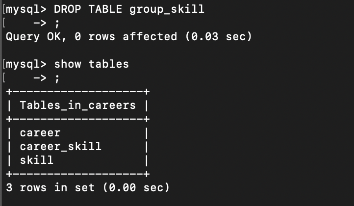

# Module 3 Database Administration.

## TASK 3.1

### PART 1

1. MySQL server successfully installed on Ubuntu 20.04. Database was created and filled :  
     
    
    

2. Operators:
   WHERE 
     
   ORDER BY 
     
   GROUP BY 
     

3. SQL queries that I used :  
   **DDL - create, alter, drop :** 
     
     
     

   **DML - select, insert, update :** 
     
     
     

   **DCL - grant, revoke :** 
     

4. Created new user and connected to the database with all privileges. 
     

### PART 2

5. Backup of database is done using the next CL and Database is restored using the next CL :  -_sudo mysqldump careers > backup_career_db.sql_   -_sudo mysql new_sunroof_DB < backup_sunroof_DB.sql_ 
    
    
    

6. Table and database were deleted using the next CL : 
   - _drop table skill;_
   - _drop database careers;_
