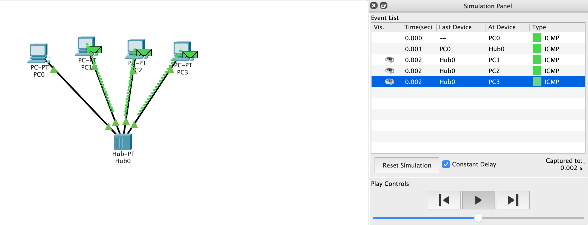
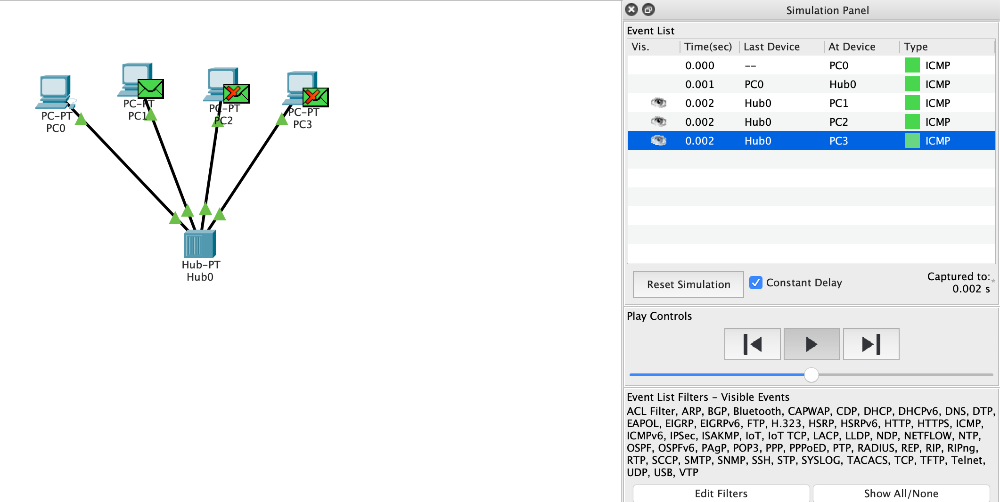
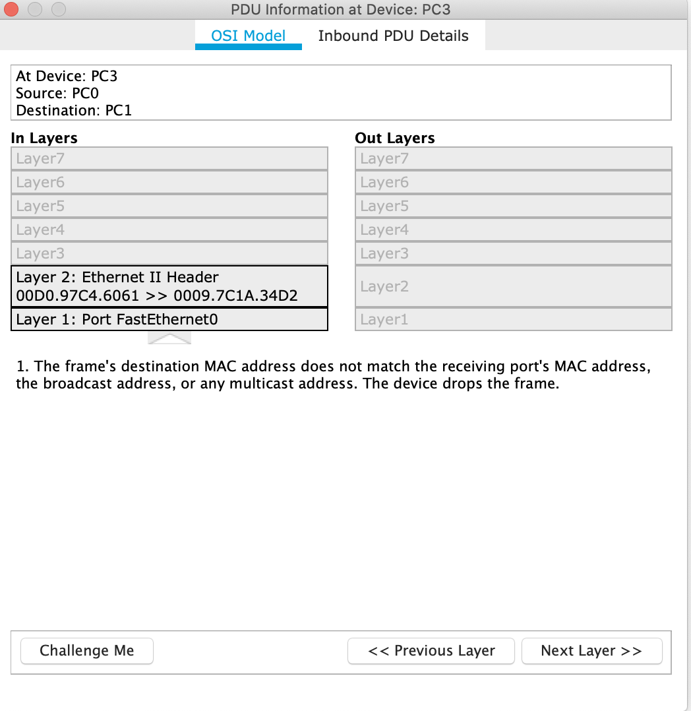
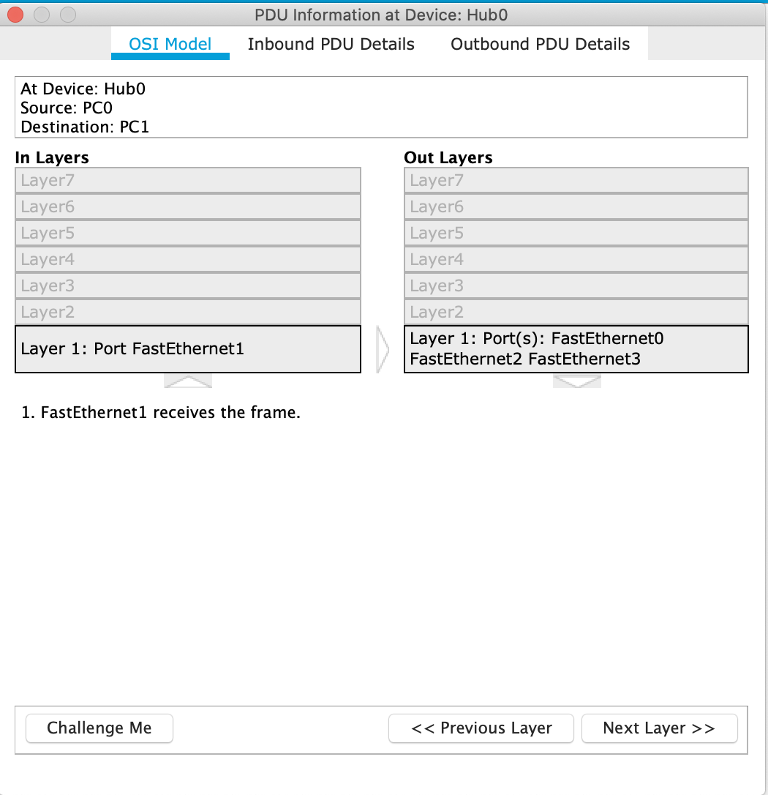
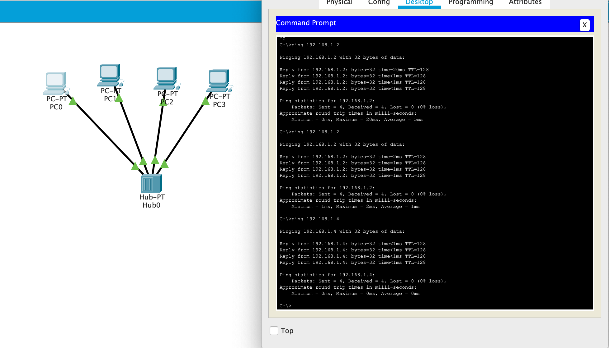
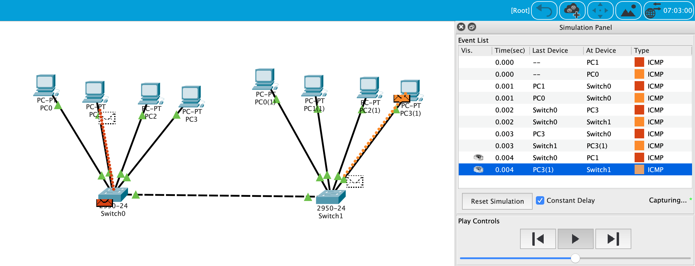
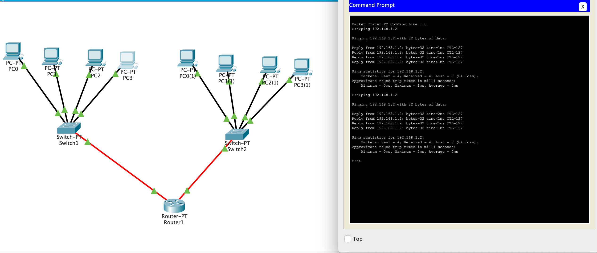

# Module 4 Networking Fundamentals

## Task 4.1

**1.** Соеденил 4 ПК в одну сеть с помощью хаба и настроил адреса, и проверел работоспособность:
  
  
**2.** Информация модели ОСІ : 
  
  
  
**3.** Соеденил 8 ПК с помощью 2 комутаторов, 4 ПК в Комутатор1 и 4 ПК в комутатор 2, Комутаторы соеденил между собой кроссовер-кабелем, настроил адреса в одной подсети: 
  
**4.** Соеденил 2 комутатора и подсети 192.168.0.0 и 192.168.1.0 с помощью маршрутизатора, настроил таблицу маршрутизации и установил сеть. Проверил соединение через ping 
  
