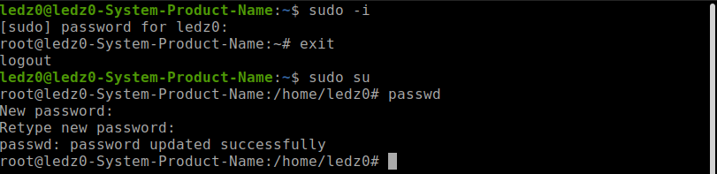
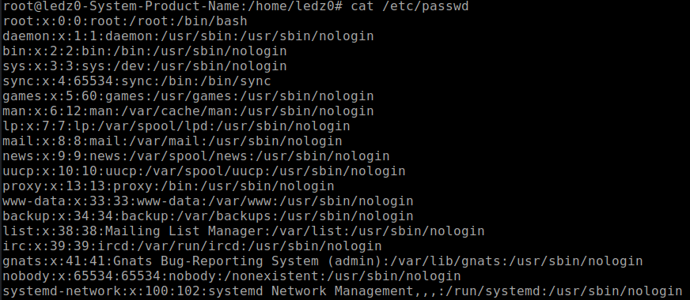
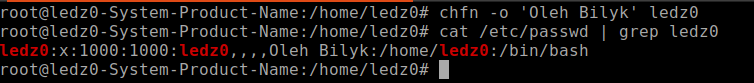
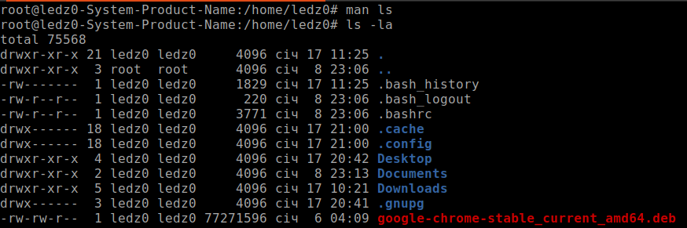
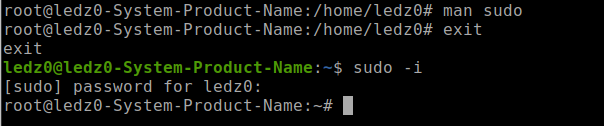
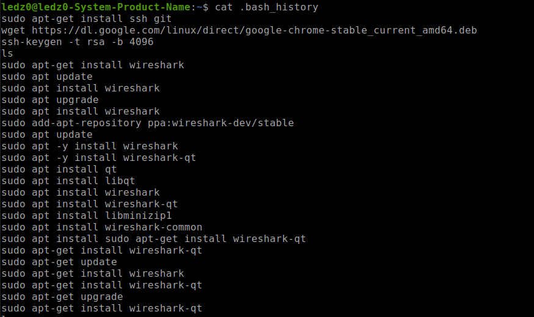
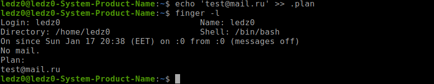
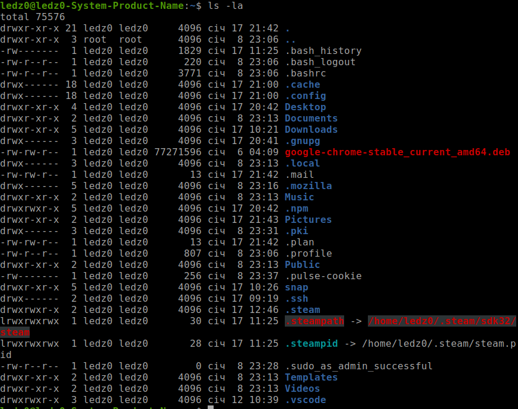

## Steps of Task5.1 execution.

1) Log in to the system as root.
2) Use the passwd command to change the password.
**'/etc/shadow'** - password is changed and stored and encrypted view.
 
3) Using command 'cat /etc/passwd', show all users in the system and see next data:
username:password:user ID (UID):group ID (GIP):personal information:shell user
 
4) I used command chfn with option '-o' to change other information
 
5) Example info about command: I saw info about 'ls' and 'sudo'
 
 
6) View the contents of files .bash*
 
7) Command finger in action.
 
8) Command ls in action, show content in directory. 
 

## Steps of Task5.2 execution.
