## Steps of Task5.1 execution.

1) Log in to the system as root.
2) Use the passwd command to change the password.
**'/etc/shadow'** - password is changed and stored and encrypted view.
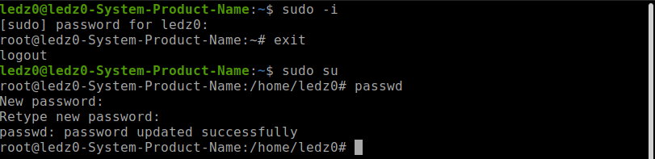
3) Using command 'cat /etc/passwd', show all users in the system and see next data:
username:password:user ID (UID):group ID (GIP):personal information:shell user
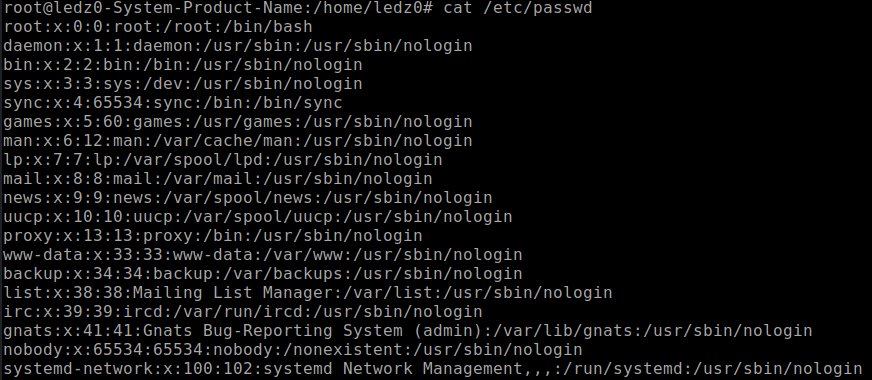
4) I used command chfn with option '-o' to change other information
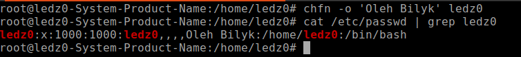
5) Example info about command: I saw info about 'ls' and 'sudo'
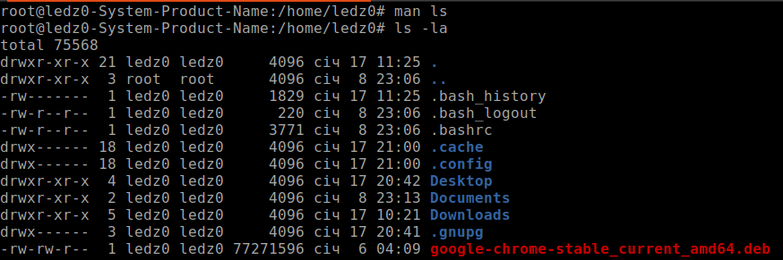

6) View the contents of files .bash*

7) Command finger in action.
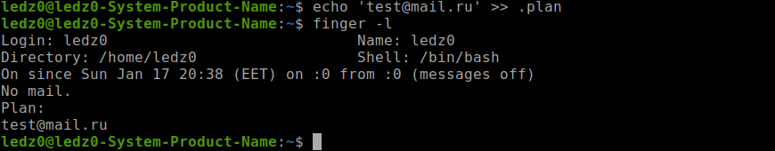
8) Command ls in action, show content in directory. 
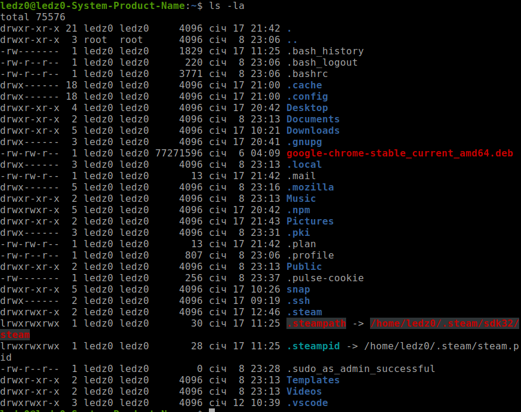

## Steps of Task5.2 execution.

1) Example tree command, with other options
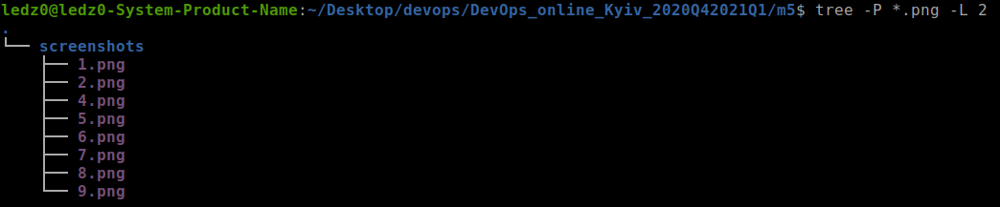
2) Using command "file" with the next option "-i" for show type file.
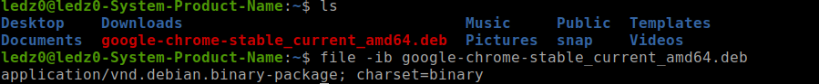
3) - For return to home catalog, next command:  
- **"cd"** 
- **"cd ~"** 
- **"cd /home/ledz0/""**
4) 
Option -l give additional insight information about folder content :

- type of file
- permissions
- number of symbolic links on that file/folder
- owner
- owner group
- size
- time of creating
Option -a shows hidden files in the target folder which start on "."
5) All steps from instruction: 
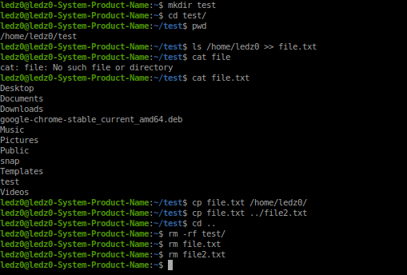
6)  All steps from instruction: 
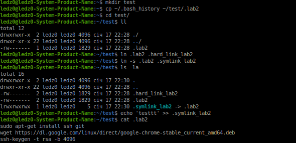
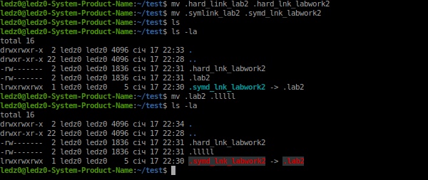
7) Command **locate -A traceroute squid** - shows nothing because there are no files with the name "squid". Only "traceroute"
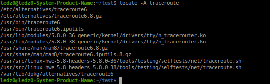
8-9) Next screenshot info about system mount partition. 
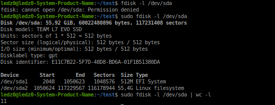
10) No results for /etc/ directory. 
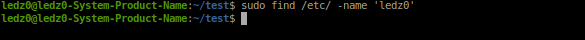
11) Using find and grep commands. 

12) Command for screen-by-screen print:
 - ls -al /etc | less
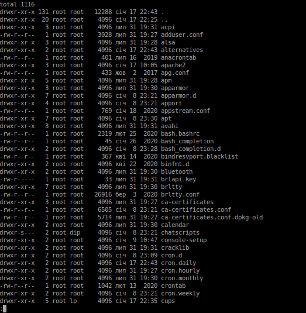
13) Show Audio, Video and USB devices 
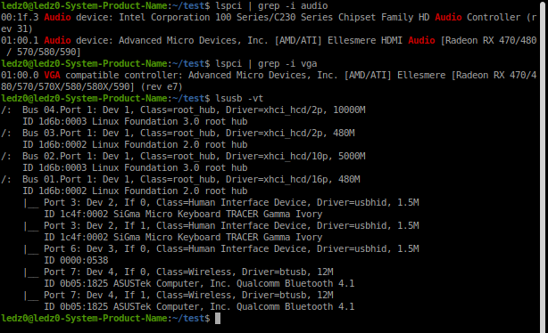
14) + Types of files :
  - regular files (-)
  - sockets (s)
  - pipes (p)
  - symbolic devices (c)
  - block devices (b)
  - symbolic links (l)
  - directories (d)