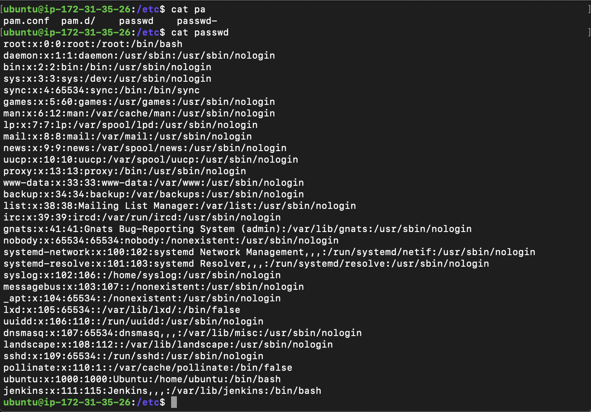
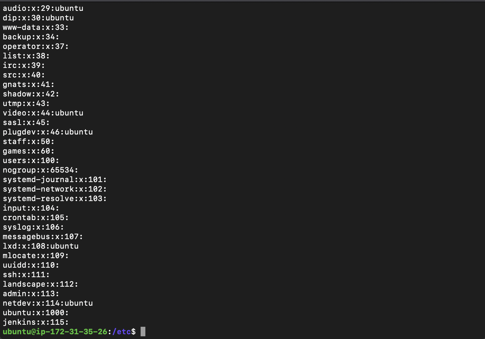
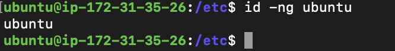
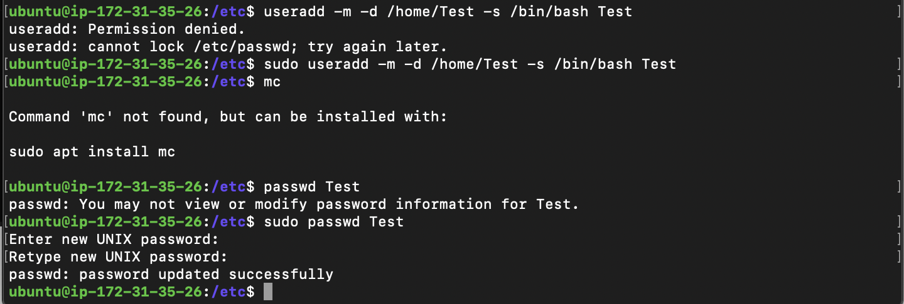
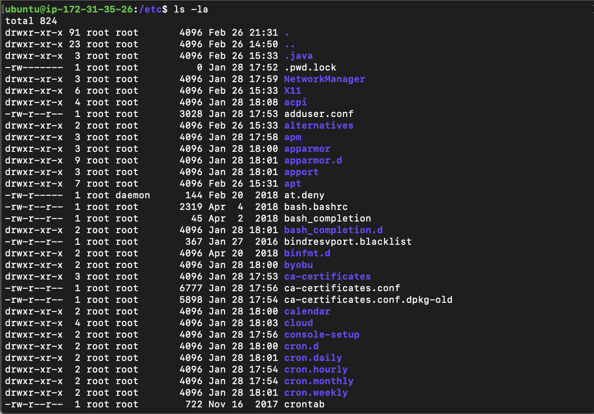
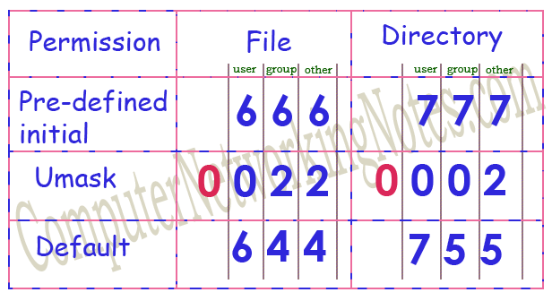
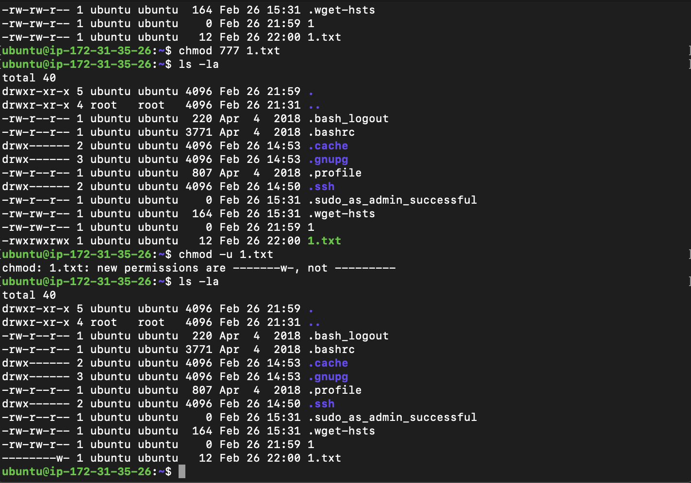
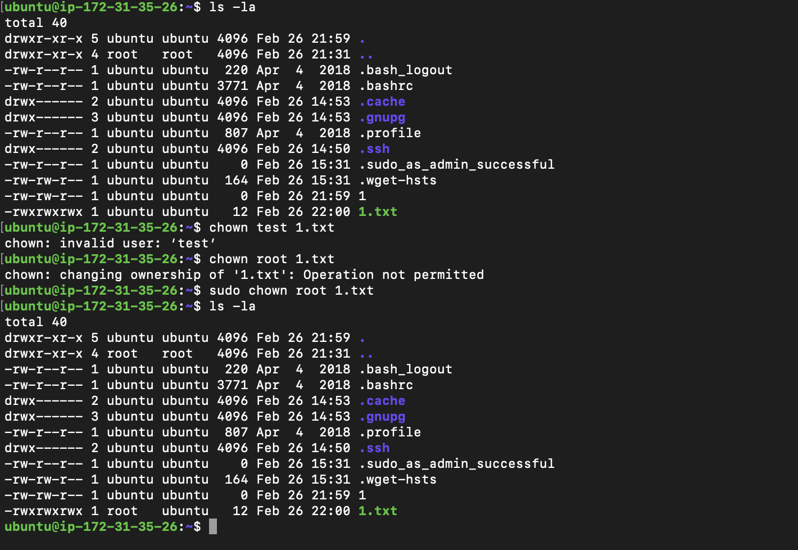

## Task 5.2

---

1. 
   Pseudo users have shell /usr/sbin/nologin.
   UID range 0-65535, is the third variable in file /etc/passwd.  
   Root ID = 0. Services ID 1-999. Users ID 1000-65534.  
   
2. The GID is group ID, is the third variable in file /etc/group.
   
3. User and his group.
   
4. Add user to the system.
   change username: usermod -l <newname> -d /home/<newname> -m <oldname>
   Directory /etc/skel/ (skel is derived from the “skeleton”) is used to initiate home directory when a user is first created. A sample layout of “skeleton” user files.
   “skeleton” directory is defined in /etc/default/useradd file.
   Userdel – r Test
   Rm /var/mail/Test
   Passwd –l $username
    Passwd –u $username
   Passwd –df \$username
   11-13) 
   Rights, hard link, user owner, group owner, size, last modified, name (file,dir).
5. There are two basic elements in Linux Filesystem:
   Directories
   Files
   There are three actions which can be performed:
   Read
   Write
   Execute. Apart from executing scripts, same actions is needed to create files and other folders inside it
   User who can perform these actions are:
   Owner of the file
   Group of the owner of the file
   User which are not associated with owner group or owner itself
6. 
   
7. 
8. When you set the sticky bit on a directory, people can only delete files that belong to them within that directory. They can’t delete files that belong to someone else, no matter which combination of file permissions are set on the files.
   sudo chmod o+t shared
